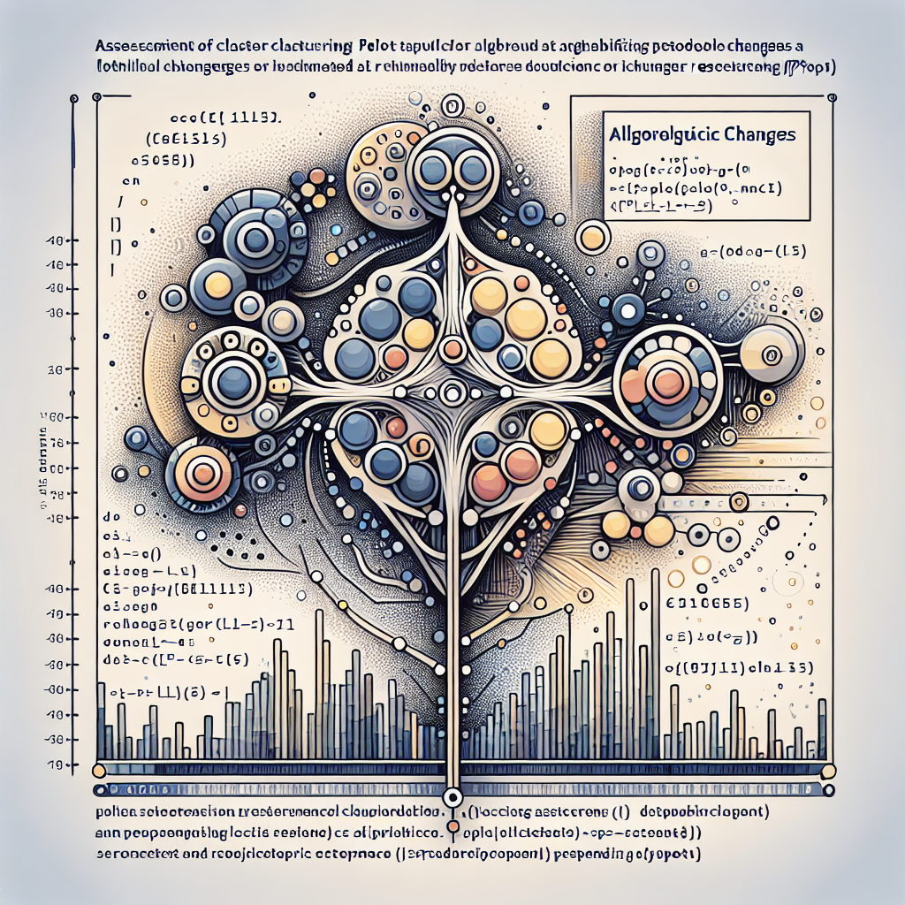

# Unveiling Clustering Stability: Hierarchical Clustering Plot for Better Assessment




**Date:** January 11, 2024  
**Contributors:** abuzarmahmood, Abuzar Mahmood  
**PR:** [https://github.com/katzlabbrandeis/blech_clust/pull/138](https://github.com/katzlabbrandeis/blech_clust/pull/138)

## Introduction
The recent pull request to the 'blech_clust' project on GitHub brings a significant improvement to the assessment of cluster stability. The changes introduce a hierarchical clustering plot for each clustering solution on every electrode, allowing for clearer visualization of the underlying features of each cluster. By doing so, it provides an enhanced way to analyze the stability of the clusters.

## Key Technical Aspects of the Changes
Three files were primarily changed in this pull request: 'blech_clust.py', 'blech_post_process.py', and 'utils/cluster_stability.py'. The latter is a new file added to the project, containing the main functionality for hierarchical clustering.

In 'blech_clust.py', a new line was added to write a command to the shell file to run the newly added 'cluster_stability.py' file:

```diff
+    f.write('python $BLECH_DIR/utils/cluster_stability.py $DATA_DIR $ELECTRODE_NUM \n')
```

'blech_post_process.py' saw a few import statements being removed, suggesting a more streamlined use of libraries.

The 'cluster_stability.py' file is the heart of these changes. Its key function is to perform hierarchical clustering on the given electrode's data and generate two subplots for each clustering solution: a dendrogram of the hierarchical clustering and the same plot but with data points colored by cluster.

Here's an example of the code in 'cluster_stability.py':

```python
# Perform hierarchical clustering on spike features
clust_dat = np.hstack((pca_slices, energy, amplitudes))
feature_names = [f'PC{x}' for x in range(pca_slic
```

## Impact and Benefits of the Changes
The introduction of a hierarchical clustering plot is a significant enhancement in the 'blech_clust' project. It allows users to better understand the stability of the clusters, which is crucial in many scientific fields, especially in neuroscience where this tool is primarily used.

The plots generated provide a visual and intuitive understanding of the data. The dendrogram displays the hierarchical relationship between clusters, while the colored plot helps distinguish between different clusters.

## Conclusion
The changes introduced in this pull request are an excellent example of how a visualization tool can enhance the understanding of complex data sets. By providing a more transparent view of the data clusters, researchers and scientists can better analyze and interpret their results, leading to more accurate conclusions. This improvement marks a significant step forward in the ongoing development of the 'blech_clust' project.