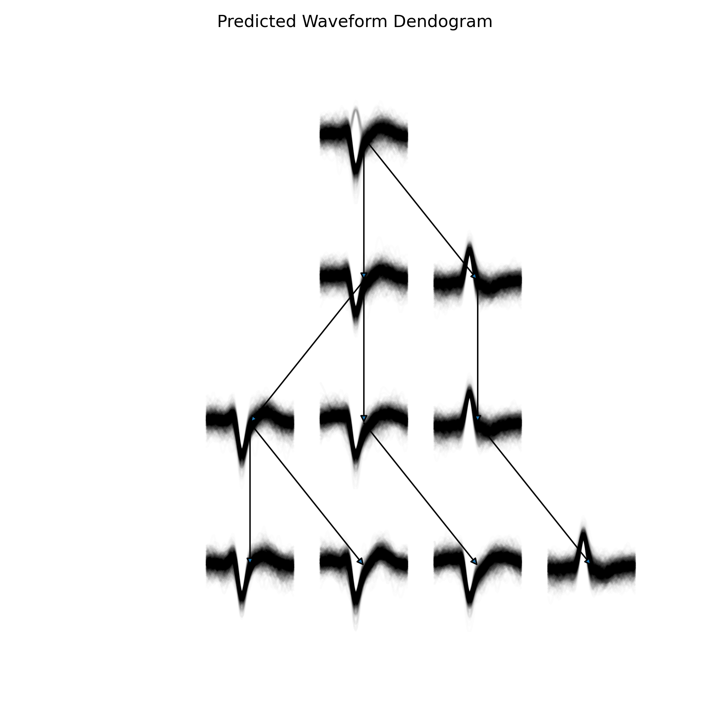

**Date:** January 11, 2024  
**Contributors:** abuzarmahmood, Abuzar Mahmood  
**PR:** [https://github.com/katzlabbrandeis/blech_clust/pull/138](https://github.com/katzlabbrandeis/blech_clust/pull/138)

# Unveiling Clustering Stability: Hierarchical Clustering Plot for Better Assessment



## Introduction
The recent pull request to the 'blech_clust' project on GitHub introduces a significant enhancement in cluster stability assessment. By incorporating a hierarchical clustering plot for each clustering solution on every electrode, it provides a clearer visualization of the underlying features of each cluster. This new approach offers an improved method for analyzing cluster stability, which is crucial for researchers, especially in fields like neuroscience.

## Key Technical Aspects of the Changes
The pull request primarily modified three files: 'blech_clust.py', 'blech_post_process.py', and the newly added 'utils/cluster_stability.py'. The addition of the latter file is pivotal as it contains the core functionality for hierarchical clustering.

### Detailed Code Changes

- **In 'blech_clust.py':**  
  A new line was added to automate the execution of the 'cluster_stability.py' script, enhancing usability and ensuring that the clustering stability analysis is seamlessly integrated into existing workflows.

  ```diff
  +    f.write('python $BLECH_DIR/utils/cluster_stability.py $DATA_DIR $ELECTRODE_NUM \n')
  ```

- **In 'blech_post_process.py':**  
  Several import statements were removed, indicating a more efficient use of libraries and possibly reducing dependencies, which can lead to faster execution times and lower memory usage.

- **In 'utils/cluster_stability.py':**  
  This script is the crux of the update, tasked with performing hierarchical clustering on electrode data. It generates two key visualizations for each clustering solution: a dendrogram and a color-coded plot of clusters.

  Here's a snippet from 'cluster_stability.py':

  ```python
  # Perform hierarchical clustering on spike features
  clust_dat = np.hstack((pca_slices, energy, amplitudes))
  feature_names = [f'PC{x}' for x in range(pca_slices.shape[1])]
  ```

  This code combines principal component analysis (PCA) slices with energy and amplitude metrics into a unified dataset for clustering, ensuring that the most relevant features are utilized.

## New Section: Understanding Hierarchical Clustering
Hierarchical clustering is a method of cluster analysis which seeks to build a hierarchy of clusters. In the context of this update, it provides a comprehensive view of data structure by breaking down datasets into nested clusters.

### Key Concepts:
- **Dendrogram:** A tree-like diagram that records the sequences of merges or splits. It visually represents the arrangement of the clusters produced by hierarchical clustering.
- **Agglomerative Approach:** This bottom-up approach starts with each element as a single cluster and merges them into larger clusters, ending with a single cluster encompassing all elements.
- **Linkage Criteria:** Determines the distance between sets of observations, influencing how clusters are formed. Common methods include single, complete, and average linkage.

## Impact and Benefits of the Changes
The hierarchical clustering plot introduced in this update enhances the 'blech_clust' project by providing users with better tools to understand cluster stability. This is especially important in neuroscience, where data interpretation can be complex and nuanced.

### Benefits:
- **Enhanced Visualization:** The dendrogram offers an intuitive understanding of the hierarchical structure, while the color-coded plot aids in the quick identification of distinct clusters.
- **Improved Analysis:** Researchers can now assess the robustness of clusters more effectively, potentially leading to more accurate scientific conclusions.
- **Streamlined Workflow:** By automating the generation of these plots, users can seamlessly integrate this analysis into their existing data processing pipelines.

## Conclusion
The enhancements introduced in this pull request are a testament to how visualization tools can significantly improve the analysis of complex datasets. By providing a more transparent view of data clusters, researchers and scientists are empowered to perform more precise analyses, ultimately leading to more reliable results. This advancement represents a substantial step forward in the evolution of the 'blech_clust' project, reinforcing its utility in scientific research.
