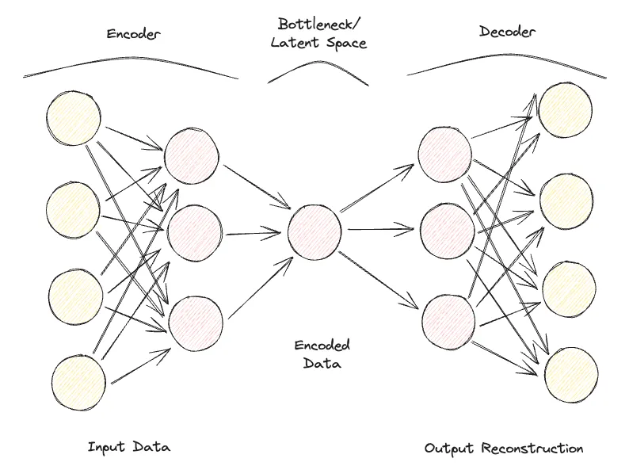
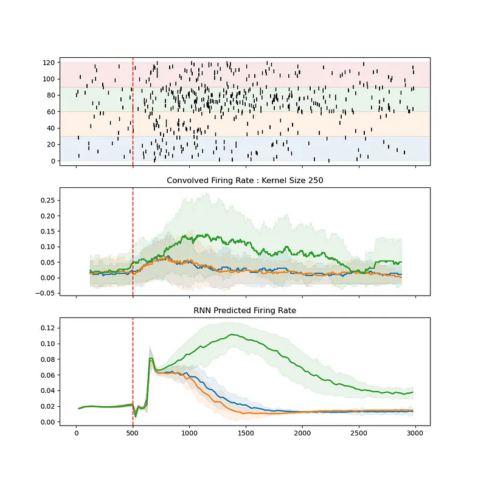

# Enhancing Neural Data Analysis with BlechRNN



**Date: September 28, 2024**  
**Contributors: Abuzar Mahmood, abuzarmahmood**  
**PR: [https://github.com/katzlabbrandeis/blech_clust/pull/226](https://github.com/katzlabbrandeis/blech_clust/pull/226)**  

## Introduction

Exciting news for the Blech Clust community! Abuzar Mahmood has just dropped a new pull request that takes our neural data analysis tools up a notch with the BlechRNN module. This latest update is all about using a Recurrent Neural Network (RNN) to figure out firing rates from spike trains. Thanks to the magic of RNNs, researchers can now dig into neural data with more accuracy and insight than ever before. Plus, there are plenty of technical tweaks and detailed documentation to help you get the most out of these new tools.

## Key Technical Aspects

### Working Version of RNN Firing Rate Inference

The star of this update is a fully operational RNN designed to infer firing rates. Essentially, it's about training an RNN on spike train data to predict firing rates—a crucial step in understanding how neurons behave. The BlechRNN library, tailored for the complexities of neural data, is what makes this possible.

**Code Snippet**:
```python
# Sample usage of infer_rnn_rates.py script
usage: infer_rnn_rates.py [-h] [--override_config] [--train_steps TRAIN_STEPS]
                          [--hidden_size HIDDEN_SIZE] [--bin_size BIN_SIZE]
                          [--train_test_split TRAIN_TEST_SPLIT] [--no_pca]
                          [--retrain] [--time_lims TIME_LIMS TIME_LIMS]
                          data_dir
```

### Enhanced Configurability and Usability

With this update comes a shiny new configuration file, `blechrnn_params.json`. This lets you tweak settings like `train_steps`, `hidden_size`, `bin_size`, and `train_test_split` to fit your specific dataset and research needs. It’s like having a custom toolset right at your fingertips!

**Example JSON Configuration**:
```json
{
    "time_lims": [1500, 4500],
    "train_steps": 15000,
    "hidden_size": 8,
    "bin_size": 25,
    "train_test_split": 0.75,
    "use_pca": true
}
```

### Comprehensive Documentation and User Guidance

The README.md file has gotten a makeover to include clear, step-by-step instructions on how to use the new RNN inference capabilities. It’s all laid out for you, from setting up to making sure your environment is running smoothly.

## Impact and Benefits

### Improved Neural Data Analysis

With RNNs stepping in to infer firing rates, researchers can dive deeper into the dynamics of neural activity. RNNs excel with sequential data, making them perfect for analyzing spike trains. This leads to more accurate models of neuronal behavior and could unlock fresh insights in neuroscience research.

### Streamlined Research Workflows

Integrating BlechRNN into the Blech Clust project means a smoother ride for researchers. This added functionality plays nicely with existing tools and datasets, cutting down on manual work and streamlining data processing.

### Example Use-Case

Imagine a research team exploring how neurons react to various taste stimuli. By applying the RNN to each taste individually, the team can get spot-on firing rate predictions for each scenario. This offers a clearer picture of how taste is encoded in the brain.

## Challenges and Development Decisions

One of the hurdles during development was ensuring the RNN model could handle the variability in neural data while keeping accuracy high. Opting to allow separate RNN training for each taste was a savvy move, acknowledging the unique firing patterns that come with different stimuli.

On top of that, robust error handling has been added to the mix. For example, if your training loss starts to outpace your test loss, you’ll get a heads-up—keeping the tool reliable and user-friendly.

## Broader Project Context

These updates are part of a broader push to enhance the Blech Clust project, which is all about giving researchers powerful tools for neural data analysis. By weaving in advanced machine learning techniques, the project is evolving to offer even more potent capabilities for interpreting complex data.



## Conclusion and Future Directions

This pull request is a big leap forward for the Blech Clust project, arming researchers with state-of-the-art tools for neural data analysis. Looking ahead, there’s potential to expand the RNN’s reach to multi-neuron data or even integrate it with other machine learning frameworks for an analytical powerhouse.

In a nutshell, bringing BlechRNN into the Blech Clust mix not only boosts the project’s functionality but also opens up exciting new research avenues in neuroscience, promising richer insights into how the brain ticks.