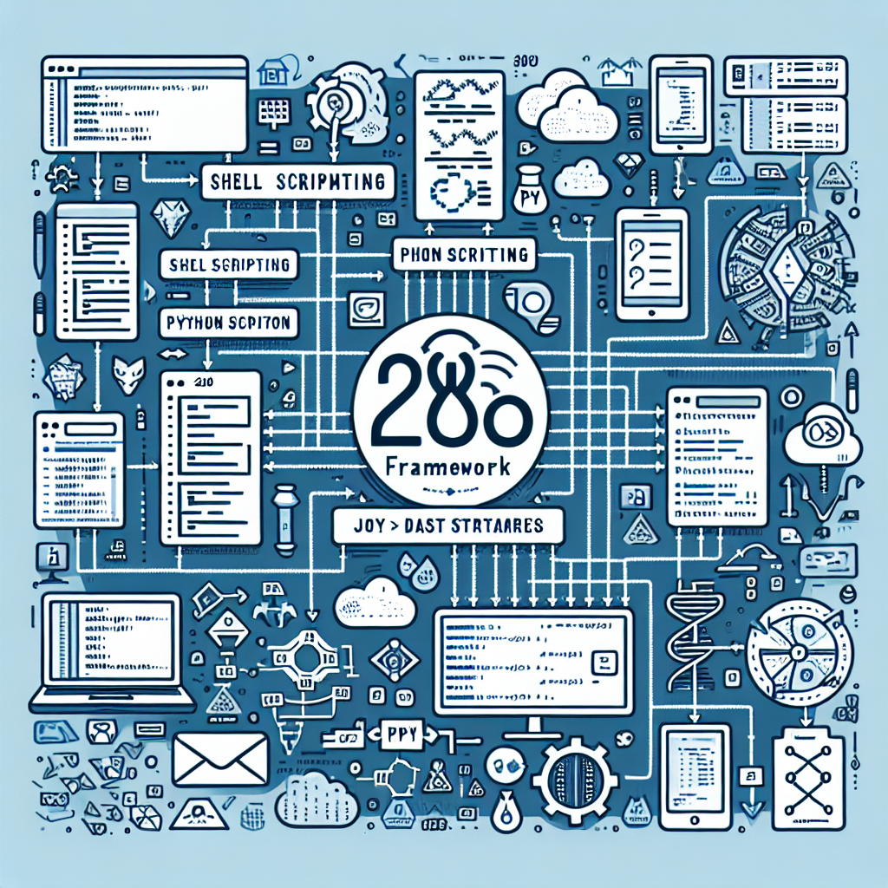

# A Revolutionary Framework for Test Dataset Creation: A Deep Dive into PR #282




## Metadata
**Date:** December 12, 2024  
**Contributors:** GitHub, abuzarmahmood, Abuzar Mahmood, Abuzar Mahmood (aider)  
**PR:** [https://github.com/katzlabbrandeis/blech_clust/pull/282](https://github.com/katzlabbrandeis/blech_clust/pull/282)  

## Introduction
On December 12, 2024, a significant pull request, #282, titled "280 framework to create test dataset", was submitted to the Katz Lab Brandeis GitHub repository. Authored by Abuzar Mahmood, this pull request introduces significant optimizations to the `blech_clust` project, focusing on how user input is handled and streamlining the generation of test datasets.

This blog post aims to dissect this pull request, highlighting the key changes, their implications, and the benefits they bring to the `blech_clust` project.

## Key Technical Changes
### 1. Introduction of `DigInHandler`
A key change in this pull request is the creation of `DigInHandler`. This handler runs during `blech_exp_info.py` and records relevant information, including pulse starts and ends, which it then writes to `dig_in_frame.csv`. This mechanism eliminates the need for reloading dig-ins in `blech_clust.py` and `blech_make_arrays.py`, improving efficiency.

```python
# Get digin and laser info
print('Getting trial markers from digital inputs')
this_dig_handler = read_file.DigInHandler(dir_name, file_type)
this_dig_handler.load_dig_in_frame()
```

### 2. Consolidation of Dig-in Numbering
`DigInHandler` also consolidates the numbering of dig-ins across file types, minimizing confusion and the usage of `dig_in_inds`, opting instead for `dig_in_num`. This change is reflected in multiple parts of the code, enhancing clarity and consistency.

### 3. Programmatic Input Support for `blech_exp_info.py`
To allow `blech_exp_info.py` to be run programmatically using command-line arguments, input handling was modified. This development allows for more efficient testing and data generation.

### 4. Bug Fixes and Optimizations
A variety of bug fixes were implemented, including handling uneven dig-in trials, fixing version number syntax, and correcting the use of `tqdm`. Additionally, there were updates to handle different versions of scipy in `lfp_processing`.

## Impact and Benefits
The changes introduced in PR #282 bring about significant improvements to the `blech_clust` project:

1. **Efficiency:** The changes streamline the creation of test datasets, reducing the need for repeated reloading of data.
2. **Clarity:** The consolidation of dig-in numbering across file types and the consistent use of `dig_in_num` help eliminate confusion.
3. **Usability:** Programmatic input support for `blech_exp_info.py` allows users to run it using command-line arguments, making it more user-friendly.
4. **Reliability:** The various bug fixes and optimizations ensure a smoother and more reliable experience for users.

## Conclusion
Pull Request #282 marks a significant milestone in the `blech_clust` project. By introducing key changes such as the `DigInHandler` and programmatic input support, the project has taken substantial strides towards increased efficiency, clarity, and usability. As we move forward, we can expect these changes to enhance the overall user experience and pave the way for future enhancements in the `blech_clust` project.
