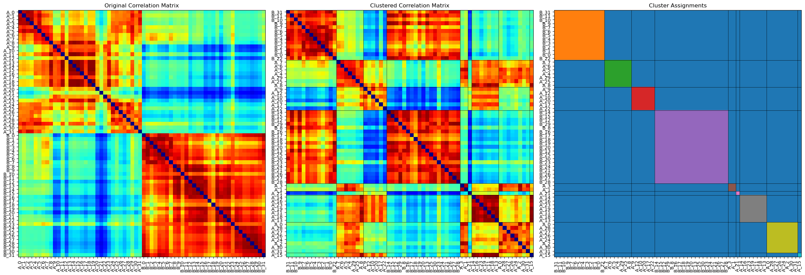
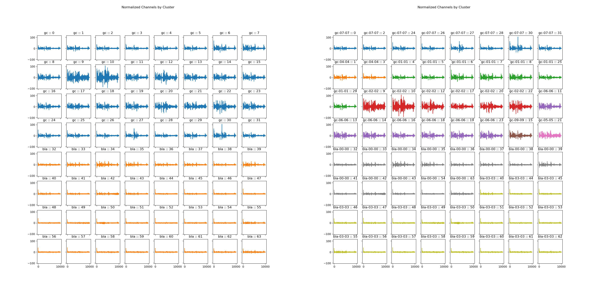

# Elevating Electrode Clustering with Bayesian Gaussian Mixture Models

**Date: March 11, 2025**

**Contributors: Abuzar Mahmood (aider), abuzarmahmood, pre-commit-ci[bot], GitHub, Abuzar Mahmood, abuzarmahmood (aider)**

**PR: [https://github.com/katzlabbrandeis/blech_clust/pull/401](https://github.com/katzlabbrandeis/blech_clust/pull/401)**



## Introduction

Big news for the `blech_clust` project: We've just rolled out a feature that takes the clustering of electrodes in Common Average Reference (CAR) groups to a whole new level. Thanks to Abuzar Mahmood, we're now using a Bayesian Gaussian Mixture model to process and visualize electrode data with more precision than ever. This isn't just a minor tweak; it's a game-changer for the pipeline, paving the way for more nuanced data analysis and interpretation.

## Key Technical Changes

### Diving into the Bayesian Gaussian Mixture Model

At the heart of this update is the Bayesian Gaussian Mixture model. What makes this model stand out? It figures out the number of clusters based on the data itself, ditching the need for any guessing games about how many clusters you should start with. Talk about flexibility!

#### Code Example

```python
def cluster_electrodes(features, n_components=10, n_iter=100, threshold=1e-3):
    model = BayesianGaussianMixture(
        n_components=n_components,
        covariance_type='full',
        max_iter=n_iter,
        tol=threshold,
        random_state=42,
        weight_concentration_prior_type='dirichlet_process',
        weight_concentration_prior=1e-2
    )
    model.fit(features)
    predictions = model.predict(features)
    return predictions, model
```

### Fine-Tuning Electrode Feature Extraction and Clustering

The update doesn't stop at the model; it also refines how we extract and cluster electrode features. By using Principal Component Analysis (PCA), we can reduce dimensionality while hanging onto 95% of the variance, ensuring the key features aren't lost in the shuffle.

#### Key Enhancements

- **All-In on Correlation Matrices**: We're leveraging the full power of correlation matrices in PCA, making feature extraction more robust.
- **Smart Dimensionality Reduction**: While clustering uses the full dataset, for visualization, we pare it down to two dimensions to keep things clear and concise.
- **Better Plotting**: We've made the plots more informative by adding cluster boundaries, which makes interpreting results a whole lot easier.

### Practical Implications

Here's why this matters:

1. **Data-Driven Clustering**: Letting the data dictate clusters means the model can reveal insights others might miss.
2. **Clearer Visuals**: The upgraded plots make it simpler to understand what's going on, crucial for validating data and exploring analysis.
3. **Resilience to Variability**: The Bayesian approach handles data variability like a champ, which is a lifesaver for analyzing electrophysiological data.

## Challenges and Development Decisions

Of course, it wasn't all smooth sailing. We hit a snag ensuring the correlation matrix was robust, especially with pesky NaN values lurking around. Our workaround? Setting NaNs to zero and ensuring matrix symmetry to dodge any analytical landmines.

We also had to carefully calibrate the Bayesian Gaussian Mixture model's parameters to strike the right balance between speed and accuracy.

## Broader Context

This isn't just a cool new feature; it's a critical enhancement for the `blech_clust` project. Accurate electrode clustering is a big deal for anyone working with neural signals or brain-computer interfaces, and these changes significantly boost our capabilities in these areas.



## Conclusion and Future Directions

The inclusion of Bayesian Gaussian Mixture models is a major leap forward for the `blech_clust` project. By elevating the precision of electrode data clustering and visualization, we've set a new benchmark for what's possible. Looking ahead, there's plenty of room to innovate, perhaps by weaving in other machine learning techniques or broadening the model's use to different kinds of electrophysiological data.

---

With these advances, the `blech_clust` project is positioned to lead the charge in electrode data analysis, equipping researchers with powerful tools to uncover new insights from their data.
```
