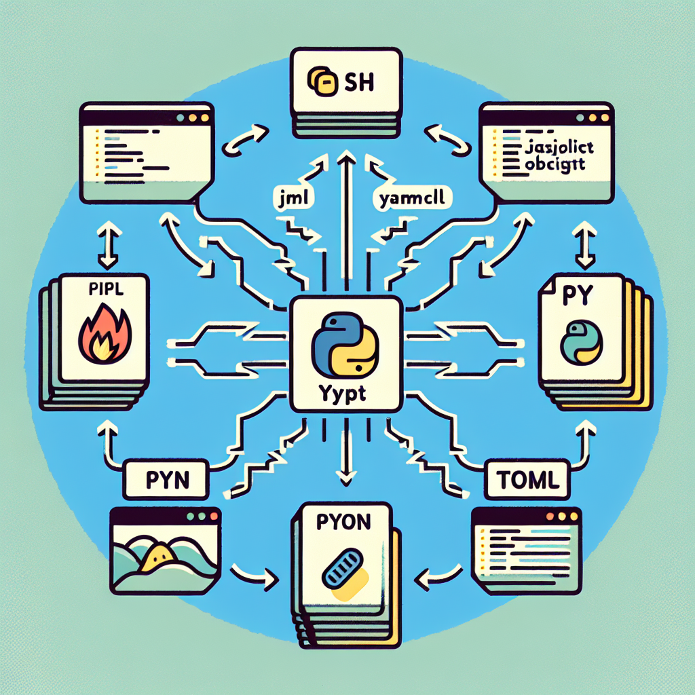

# Setting Up a Pip-Installable Package for Blech Clust



**Date: October 16, 2025**  
**Contributors: abuzarmahmood, pre-commit-ci[bot], Abuzar Mahmood (aider), Abuzar Mahmood**  
**PR: [https://github.com/katzlabbrandeis/blech_clust/pull/603](https://github.com/katzlabbrandeis/blech_clust/pull/603)**

## Introduction

We've got some exciting updates for the `blech_clust` package! To make life easier for everyone involved, we've revamped the package structure to be pip-installable. This nifty change, detailed in [PR #603](https://github.com/katzlabbrandeis/blech_clust/pull/603), brings in a shiny new `pyproject.toml` file and upgrades the package's import statements to be cleaner and more modular. We're addressing issue #483 here, aiming for smoother usability and consistency across all sorts of development environments.

## Key Technical Changes

### 1. Introduction of `pyproject.toml`

One of the big stars of this update is the `pyproject.toml` file. Think of it as the package's new blueprint, organizing everything from A to Z. Here's what's inside:

- **Package Metadata**: We're talking name, version, description, and authors—all laid out clearly.
- **Build System**: We've embraced `setuptools` for the build system, which is now the cool kid in Python packaging.
- **Dependencies**: All those dependencies from `requirements.txt`? They’ve found a new home here, making management a breeze. We even threw in optional development dependencies for good measure.
- **Code Formatting and Testing**: With settings for the `black` formatter and `pytest` included, our code stays neat and reliable.

### 2. Import Statement Overhaul

Consistency is key, and we've overhauled import statements to reflect that. We swapped out those pesky relative paths like `from utils.` for absolute ones:

- From `from utils.` to `from blech_clust.utils.`
- From `from emg.` to `from blech_clust.emg.`

This update spans 33 Python files and is all about keeping things clear and predictable, especially as we scale up.

### 3. Revised Package Structure

We've realigned the package structure with best practices, mapping `blech_clust` to the root directory using `setuptools`. Here's what that looks like:

- **Subpackages**: Say hello to `blech_clust.utils` and `blech_clust.emg`, housing modules like `qa_utils`, `ephys_data`, and `gape_QDA_classifier`.
- **Package Data**: We've got shell scripts, markdown files, and config files all bundled up, so you have everything you need right at your fingertips.

## Impact and Benefits

These updates are a game-changer for developers:

- **Simplified Installation**: Installing the package is now as easy as pie. Just run `pip install -e .`, or grab it straight from GitHub. No more wrestling with complex setups!

  ```bash
  pip install -e .
  ```

  Or directly from GitHub:

  ```bash
  pip install git+https://github.com/katzlabbrandeis/blech_clust.git
  ```

- **Consistent Environment Setup**: With CI/CD pipelines and local environments playing nicely together, consistency is the name of the game. The Makefile now dynamically installs packages and dependencies, reducing the chance of errors.

- **Improved Code Maintenance**: Absolute imports and consolidated dependencies in `pyproject.toml` make the codebase a breeze to navigate and maintain.

## Code Examples

### Updated Makefile

The Makefile now flexes some new muscles with dynamic dependency installation:

```makefile
base:
    @echo "Installing Python dependencies from requirements.txt..."
    conda run -n blech_clust pip install --no-cache-dir -r requirements/requirements.txt
    @echo "Installing blech_clust package..."
    conda run -n blech_clust pip install --no-cache-dir -e .
```

### Workflow Changes

GitHub workflows are on board with the changes, ensuring tests and builds run smoothly with the new package setup:

```yaml
- name: Install blech_clust with test dependencies
  run: |
    make base test
```

## Challenges and Decisions

Updating import statements across 33 files was no small feat. We had to work carefully to avoid any slip-ups. The move to `pyproject.toml` was a strategic one, aligning with the latest Python packaging standards and providing a more unified approach than the old `setup.py`.

## Conclusion and Future Directions

This update is a significant leap forward for `blech_clust`, bringing it in line with modern Python packaging standards. Looking ahead, we’re thinking about further modularizing the codebase, boosting test coverage, and exploring more CI/CD optimizations. This PR lays down a solid foundation for future development, keeping the package robust and user-friendly.

For all the juicy details, check out the [PR on GitHub](https://github.com/katzlabbrandeis/blech_clust/pull/603).