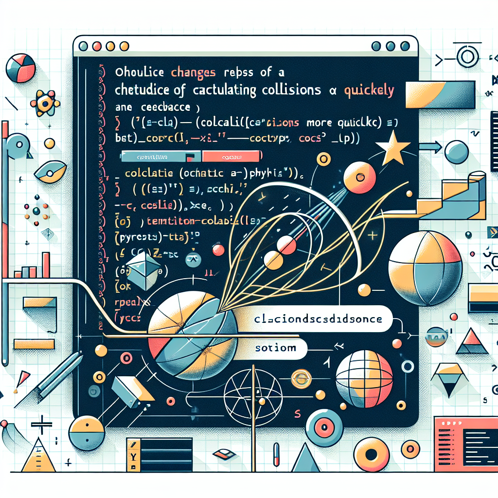

# Supercharging Collision Calculations: Accelerating Algorithm Efficiency




**Date:** April 07, 2023  
**Contributors:** abuzarmahmood  
**PR:** [https://github.com/katzlabbrandeis/blech_clust/pull/64](https://github.com/katzlabbrandeis/blech_clust/pull/64)

In the world of computational neurobiology, every millisecond counts. When it comes to calculating collisions in spike times, efficiency is paramount. Enter this latest pull request (PR) from contributor abuzarmahmood, who has undertaken the task of enhancing the algorithm for collision calculations, making it faster and more efficient.

In the PR, abuzarmahmood has made significant changes to the `blech_units_similarity.py` file, adding a new, faster algorithm for calculating collisions. This algorithm, `unit_similarity_abu()`, is designed to improve the speed at which collisions are calculated, leading to more efficient data processing.

```diff
+def unit_similarity_abu(all_spk_times):
+    int_spike_times = [np.array(x, dtype=np.int32) for x in all_spk_times]
+    spike_counts = [len(x) for x in int_spike_times]
+    # Count duplicates generated due to binning
+    mat_len = max([max(x) for x in int_spike_times])
+    ...
```

The new algorithm employs numpy arrays for storing spike times, calculates the maximum length for the matrix, and populates the matrix with spike times. The algorithm then iterates over each unit, checking for other units that have spikes within 1 ms of the current unit's spike. The result is a far more efficient, faster approach to calculating collisions.

This PR doesn't stop at just the addition of a new method. The original method `unit_similarity()` has also been tweaked for better readability and efficiency. It now uses a cleaner, more Pythonic approach to increment counters when spike times coincide within a given threshold.

```diff
@jit(nogil=True)
 def unit_similarity(this_unit_times, other_unit_times):
     this_unit_counter = 0
     other_unit_counter = 0
     for this_time in this_unit_times:
         for other_time in other_unit_times:
             if abs(this_time - other_time) <= 1.0:
-                    this_unit_counter += 1
-                    other_unit_counter += 1
+                this_unit_counter += 1
+                other_unit_counter += 1
     return this_unit_counter, other_unit_counter
```

The impact of these changes cannot be underestimated. By increasing the speed and efficiency at which collisions are calculated, we can process more data in less time. This will lead to faster computations, quicker results, and a more seamless experience for researchers working in computational neurobiology.

In conclusion, this PR showcases the power of thoughtful, targeted optimizations. By focusing on a key computational bottleneck - the calculation of collisions - and devising a new algorithm to tackle the problem more efficiently, abuzarmahmood has made a significant contribution to the project. This PR serves as a reminder of the power of algorithmic enhancements in the realm of data-intensive computation.